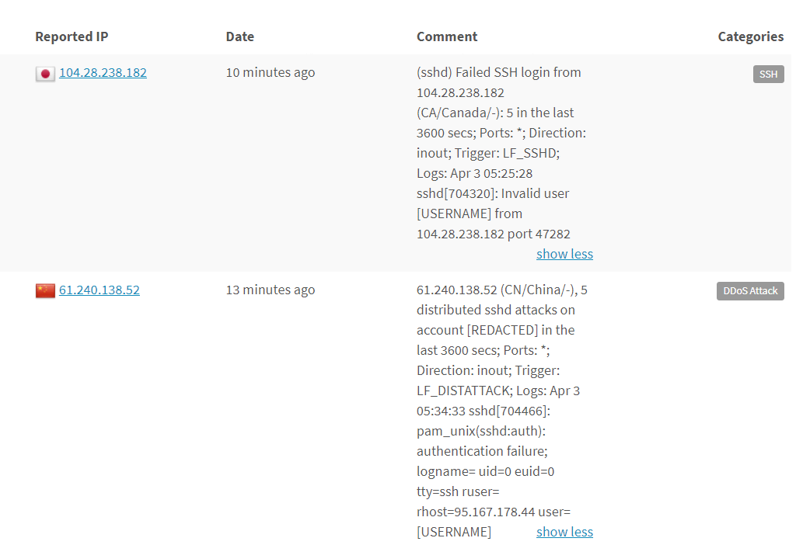
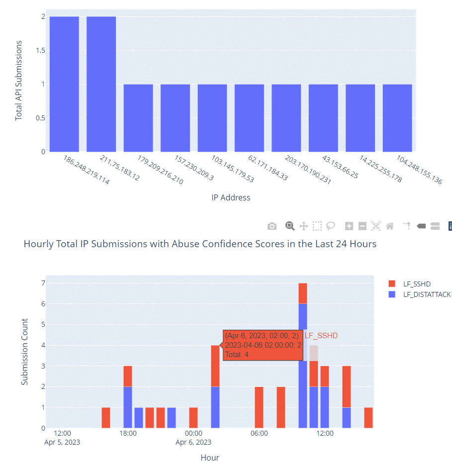

      

# CSF Firewall + AbuseIPDB Integration

This `abuseipdb-reporter.py` python script allows you to utilise CSF Firewall to automatically detects harmful online activity and reports it to a [AbuseIPDB security database](https://www.abuseipdb.com). It helps make the internet safer by sharing information about suspicious IP addresses with other network administrators. It's customizable, user-friendly, and provides helpful feedback for easier use and troubleshooting. If you like my work, please star it and/or become a sponsor.

Tailored for Centmin Mod LEMP stack based servers that install CSF Firewall by default with a specific focus on data privacy and prevention of sensitive data leaked to public AbuseIPDB database reports. Though technically should work with any servers that use CSF Firewall. For a more detailed summary of the `abuseipdb-reporter.py` Python script and what it does, read the [Credits](#credits).

Based on CSF Firewall and AbuseIPDB integration guide at https://www.abuseipdb.com/csf. However, that guides provided Perl, Shell and Python scripts will all leak some private sensitive data about your servers in their default state for some situations i.e. if you enable [CSF Cluster mode](#csf-cluster-mode), your CSF Cluster members' real IP addresses are leaked. The `abuseipdb-reporter.py` python script I created and outlined below will privacy mask all sensitive info like usernames, Linux users, CSF Cluster mode members' real IP addresses and also detect and mask any registered server public IP addresses.

## Guide

This guide will show you how to set up CSF Firewall so that attempted intrusions against your system are automatically blocked by CSF's Login Failure Daemon (lfd) logged actions. It is also possible to use CSF Firewall to pre-emptively block bad IP addresses using [CSF Firewall's blocklist feature and AbuseIPDB's collated blocklist database](#setup).

* [Dependencies](#dependencies)
* [Setup](#setup)
  * [Configuration](#configuration)
    * [Log Rotation](#log-rotation)
  * [Local IP Cache](#local-ip-cache)
  * [abuseipdb-reporter.ini](#abuseipdb-reporterini)
    * [Override AbuseIPDB Categories](#override-abuseipdb-categories)
  * [Log Inspection](#log-inspection)
  * [Example](#example)
  * [JSON log format](#json-log-format)
    * [Parsing JSON formatted logs](#parsing-json-formatted-logs)
      * [Convert JSON Format Back To Non-JSON Format](#convert-json-format-back-to-non-json-format)
* [CSF Cluster Mode](#csf-cluster-mode)
  * [JSON log format CSF Cluster](#json-log-format-csf-cluster)
* [AbuseIPDB API Submissions](#abuseipdb-api-submissions)
  * [Plaintext Logged Submission](#plaintext-logged-submission)
  * [JSON Logged Submission](#json-logged-submission)
    * [JSON Log Submission Parsing](#json-log-submission-parsing)
  * [Port Scan Submission](#port-scan-submission)
* [Manual Tests](#manual-tests)
* [Additional Tools](#additional-tools)
  * [lfd-rate.py](#lfd-ratepy)
  * [abuseipdb-checker.py](#abuseipdb-checkerpy)
  * [abuseipdb-plotter.py](#abuseipdb-plotterpy)
    * [AbuseIPDB Charts](#abuseipdb-charts)
* [Credits](#credits)

## Dependencies

Python 3.x required as well as `requests` module:


Centmin Mod users on CentOS 7.x, can install Python 3.x via `addons/python36_install.sh`

```
/usr/local/src/centminmod/addons/python36_install.sh
pip3 install requests
```

Or if on EL8+, can install Python 3 via

```
yum -y install python3
pip3 install requests
```

## Setup

1. Create an AbuseIPDB API key

Register an account with AbuseIPDB, and [create an API key](https://www.abuseipdb.com/account/api). The API is free to use, but you do have to [create an account](https://www.abuseipdb.com/register). If you [verify your domain name as a webmaster](https://www.abuseipdb.com/account/webmasters), you can also bump your free plan quota from 1,000 requests/day to 3,000 requests/day to the API.

You can see your API quota usage at https://www.abuseipdb.com/account/api and view and manage your reported IP submissions at https://www.abuseipdb.com/account/reports.

2. Integrating AbuseIPDB Blocklist Into CSF Firewall

The `/etc/csf/csf.blocklist` feature in CSF Firewall is a way to block a list of IP addresses that are known to be malicious or spammy. The blocklist is a text file that contains a list of IP addresses that you want to block. These IP addresses can come from a variety of sources, such as third-party blocklists or your own custom list.

When you enable the `/etc/csf/csf.blocklist `feature, CSF Firewall will regularly check the blocklist file for updates and automatically add any new IP addresses to the firewall's blocklist. This means that if any of the listed IP addresses attempt to connect to your server, they will be automatically blocked by CSF Firewall, preventing any potential security threats.

In short, the `/etc/csf/csf.blocklist` feature is a powerful tool to help protect your server from known malicious IP addresses by blocking them automatically.

AbuseIPDB API has daily API usage limits for free and paid plans outlined at https://www.abuseipdb.com/pricing. For webmaster verified free plan the daily API usage limits are outlined in below table. The `blacklist` quota is what the blocklists will consume. While the below steps to report bad IP addresses will consume the `reports` quota of 3,000/day on webmaster verified free plan.

| Endpoint      | Usage / Daily Limit | Utilization Rate |
|---------------|---------------------|------------------|
| check         | 0 / 3,000           | 0%               |
| reports       | 0 / 500             | 0%               |
| blacklist     | 0 / 10              | 0%              |
| report        | 0 / 3,000           | 0%               |
| check-block   | 0 / 1,000           | 0%               |
| bulk-report   | 0 / 10              | 0%               |
| clear-address | 0 / 10              | 0%               |

To use the CSF Firewall blocklist feature with AbuseIPDB database blocklist, do the following:

Edit `/etc/csf/csf.blocklists` and add blocklist for AbuseIPD and change `YOUR_API_KEY` to your API Key from step 1.

```
# AbuseIPDB blacklist
# Details: https://docs.abuseipdb.com/#blacklist-endpoint
ABUSEIPDB|86400|10000|https://api.abuseipdb.com/api/v2/blacklist?key=YOUR_API_KEY&plaintext
```
Then restart CSF Firewall

```
csf -ra
```

The `/var/log/lfd.log`, will now show the AbuseIPDB blocklists loaded

```
Mar 27 08:28:28 host lfd[572547]: Retrieved and blocking blocklist ABUSEIPDB IP address ranges
Mar 27 08:28:28 host lfd[572547]: IPSET: loading set new_ABUSEIPDB with 4087 entries
Mar 27 08:28:28 host lfd[572547]: IPSET: switching set new_ABUSEIPDB to bl_ABUSEIPDB
Mar 27 08:28:28 host lfd[572547]: IPSET: loading set new_6_ABUSEIPDB with 3 entries
Mar 27 08:28:28 host lfd[572547]: IPSET: switching set new_6_ABUSEIPDB to bl_6_ABUSEIPDB
Mar 27 08:33:28 host lfd[572611]: Retrieved and blocking blocklist BDE IP address ranges
Mar 27 08:33:28 host lfd[572611]: IPSET: loading set new_BDE with 269 entries
Mar 27 08:33:28 host lfd[572611]: IPSET: switching set new_BDE to bl_BDE
Mar 27 08:33:28 host lfd[572611]: IPSET: loading set new_6_BDE with 1 entries
Mar 27 08:33:28 host lfd[572611]: IPSET: switching set new_6_BDE to bl_6_BDE
```

You can calculate your CSF Firewall IPSET chain memory usage and number of IP entries using command:

```
ipset list -t | awk '/^Name:/ { name=$2 } /^Size in memory:/ { memory+=$4 } /^Number of entries:/ { entries+=$4 } END { printf "Total IPSET Entries: %d\nTotal IPSET Memory Usage: %.2f MB\nTotal IPSET Chains: %d\n", entries, memory/1048576, NR }'

Total IPSET Entries: 47652
Total IPSET Memory Usage: 1.28 MB
Total IPSET Chains: 287
```

List all IPSET chains

```
ipset list -t
```

In JSON format

```
ipset list -t | awk '/^Name:/ { name=$2 } /^Type:/ { type=$2 } /^Revision:/ { revision=$2 } /^Header:/ { header=$0 } /^Size in memory:/ { size_in_memory=$4 } /^References:/ { references=$2 } /^Number of entries:/ { number_of_entries=$4; printf "{\"name\":\"%s\", \"type\":\"%s\", \"revision\":\"%s\", \"header\":\"%s\", \"size_in_memory\":\"%s\", \"references\":\"%s\", \"number_of_entries\":\"%s\"}\n", name, type, revision, header, size_in_memory, references, number_of_entries }' | jq -s .
```

3. Reporting to AbuseIPDB

Setup the `abuseipdb-reporter.py` Python script on your Centmin Mod LEMP stack server and for CSF Firewall `BLOCK_REPORT`. You can save it to any location you want. For this example, saved to `/root/tools/abuseipdb-reporter.py`.

Ensure `/root/tools/abuseipdb-reporter.py` is executable using `chmod`:

```
chmod +x /root/tools/abuseipdb-reporter.py
```

Or clone this repo:

```
cd /home
git clone https://github.com/centminmod/centminmod-abuseipdb-reporter
cd /home/centminmod-abuseipdb-reporter
```

Set the `BLOCK_REPORT` variable in `/etc/csf.conf` to the executable script file.

```
BLOCK_REPORT = "/root/tools/abuseipdb-reporter.py"
```

or

```
BLOCK_REPORT = "/home/centminmod-abuseipdb-reporter/abuseipdb-reporter.py"
```

restart CSF and lfd using:

```
csf -ra
```

## Configuration

Edit the `/root/tools/abuseipdb-reporter.py` or `/home/centminmod-abuseipdb-reporter/abuseipdb-reporter.py` script's variables directly or better way is to set override variables in [abuseipdb-reporter.ini](#abuseipdb-reporterini) settings file so you don't need to edit the script directly:

* `DEBUG = True` - When set to `True`, debug mode is enabled and no actual CSF Firewall block actions will be sent to AbuseIPDB via API endpoint url. Instead block actions will be saved to a local log file `/var/log/abuseipdb-reporter-debug.log`. You can use this mode for troubleshooting or testing before you eventually set `DEBUG = False` to enable actual CSF Firewall block actions to be sent to AbuseIPDB via API endpoint url.
* `API_KEY = 'YOUR_API_KEY'` - Set `YOUR_API_KEY` to your AbuseIPDB API key
* `JSON_LOG_FORMAT = False` - Set to `False` by default to save `DEBUG = True` debug log to specified `DEFAULT_LOG_FILE = '/var/log/abuseipdb-reporter-debug.log'`. When set to `True` will save in JSON format to specified `DEFAULT_JSONLOG_FILE = '/var/log/abuseipdb-reporter-debug-json.log'` log file instead. The JSON log format makes parsing and filtering the debug log easier [JSON format demo](#json-log-format) and [CSF Cluster JSON format demo](#json-log-format-csf-cluster).
* `USERNAME_REPLACEMENT = [USERNAME]` - for privacy masking, Linux usernames are masked before being sent to AbuseIPDB, this is the replacement word value.
* `ACCOUNT_REPLACEMENT = [REDACTED]` - for privacy masking, Linux account usernames are masked before being sent to AbuseIPDB, this is the replacement word value.
* `CACHE_FILE = "ip_cache.json"` - local IP cache file name to save IPs for 15 minutes so repeated IPs within 15 minutes interval are not submitted to AbuseIPDB endpoint again and skipped. See [Local IP Cache](#local-ip-cache) for more information.
* `CACHE_DURATION = 900` - controls local IP cache time to save IPs for. Defaults to 15 minutes (900 seconds).

Example of `USERNAME_REPLACEMENT = [USERNAME]` privacy masking the Comments details

```
Comment: (sshd) Failed SSH login from 5.189.165.229 (DE/Germany/vmi927439.contaboserver.net): 5 in the last 3600 secs; Ports: *; Direction: inout; Trigger: LF_SSHD; Logs: Mar 31 00:41:53 sshd[13465]: pam_unix(sshd:auth): authentication failure; logname= uid=0 euid=0 tty=ssh ruser= rhost=5.189.165.229  user=[USERNAME]
Mar 31 00:41:55 sshd[13465]: Failed password for [USERNAME] from 5.189.165.229 port 51296 ssh2
Mar 31 00:45:27 sshd[15102]: Invalid user [USERNAME] from 5.189.165.229 port 35276
Mar 31 00:45:29 sshd[15102]: Failed password for invalid user [USERNAME] from 5.189.165.229 port 35276 ssh2
Mar 31 00:46:35 sshd[15383]: Invalid user [USERNAME] from 5.189.165.229 port 59862
```

### Log Rotation

Setup log rotation `/etc/logrotate.d/abuseipdb` with contents

```
"/var/log/abuseipdb-reporter-debug.log" "/var/log/abuseipdb-reporter-debug-json.log" "/var/log/abuseipdb-reporter-api.log" "/var/log/abuseipdb-reporter-api-json.log" "/var/log/abuseipdb-invalid-log.log" {
        daily
        dateext
        missingok
        rotate 10
        compress
        delaycompress
        notifempty
}
```
```
logrotate -fv /etc/logrotate.d/abuseipdb
ls -lahrt /var/log | grep abuse
```

### Local IP Cache

`abuseipdb-reporter.py` version `0.2.5` adds local IP caching support via 2 new variables which control where and how long to cache IP submissions to AbuseIPDB API when DEBUG = False is set. 

```
CACHE_FILE = ip_cache.json
CACHE_DURATION = 900
```

Then when an IP is to be submitted via API, the local IP cache routine will check to see if the IP has been previously submitted in the past 15 minutes (900 seconds) and skip submission to AbuseIPDB API if the IP is found in local IP cache. If the IP isn't found in local IP cache, the IP will be submitted to AbuseIPDB and then the IP will be added to local IP cache for storage for 15 minues before eventually being purged from local IP cache. This adheres to the AbuseIPDB FAQ recommendations `#9` at https://www.abuseipdb.com/faq.html.

Here's a [manual command line test](#manual-tests) demo for IP = `127.0.0.3` showing how it works below:

The manual test command:

```
python3 abuseipdb-reporter.py "127.0.0.3" '*' "0" "inout" "360" "(sshd) Failed SSH login from 127.0.0.3 (VN/Vietnam/-): 5 in the last 3600 secs" "Apr 2 07:18:50 host sshd[7788]: Invalid user free from 127.0.0.3 port 49518..." "LF_SSHD"
```

Outputs 1st run

```
Received arguments: ['127.0.0.3', '*', '0', 'inout', '360', '(sshd) Failed SSH login from 127.0.0.3 (VN/Vietnam/-): 5 in the last 3600 secs', 'Apr 2 07:18:50 host sshd[7788]: Invalid user free from 127.0.0.3 port 49518...', 'LF_SSHD']

Ports: *
In/Out: inout
Message: (sshd) Failed SSH login from 127.0.0.3 (VN/Vietnam/-): 5 in the last 3600 secs
Logs: Apr 2 07:18:50 host sshd[7788]: Invalid user free from 127.0.0.3 port 49518...
Trigger: LF_SSHD
{
    "abuseConfidenceScore": 0,
    "ipAddress": "127.0.0.3"
}
{
    "abuseConfidenceScore": 0,
    "ipAddress": "127.0.0.3"
}
```

The local IP cache `ip_cache.json` file's contents:

```
cat ip_cache.json | jq -r
{
  "127.0.0.3": 1680445170.5792017
}
```

Outputs for 2nd run within 15 minute interval for same `127.0.0.3` IP - notice the message `IP address already reported within the last 15 minutes. Skipping submission.` that means IP submission was skipped.

```
Received arguments: ['127.0.0.3', '*', '0', 'inout', '360', '(sshd) Failed SSH login from 127.0.0.3 (VN/Vietnam/-): 5 in the last 3600 secs', 'Apr 2 07:18:50 host sshd[7788]: Invalid user free from 127.0.0.3 port 49518...', 'LF_SSHD']

Ports: *
In/Out: inout
Message: (sshd) Failed SSH login from 127.0.0.3 (VN/Vietnam/-): 5 in the last 3600 secs
Logs: Apr 2 07:18:50 host sshd[7788]: Invalid user free from 127.0.0.3 port 49518...
Trigger: LF_SSHD
IP address already reported within the last 15 minutes. Skipping submission.
```

## abuseipdb-reporter.ini

The script now supports `abuseipdb-reporter.ini` file you can create within same directory as `abuseipdb-reporter.py` script to override the following settings without editing the `abuseipdb-reporter.py` script itself:

```
[settings]
DEBUG = True
LOG_API_REQUEST = True
LOG_MODE = full
JSON_LOG_FORMAT = False
JSON_APILOG_FORMAT = False
IGNORE_CLUSTER_SUBMISSIONS = True
API_KEY = YOUR_API_KEY
DEFAULT_LOG_FILE = /var/log/abuseipdb-reporter-debug.log
DEFAULT_JSONLOG_FILE = /var/log/abuseipdb-reporter-debug-json.log
DEFAULT_APILOG_FILE = /var/log/abuseipdb-reporter-api.log
DEFAULT_JSONAPILOG_FILE = /var/log/abuseipdb-reporter-api-json.log
mask_hostname = MASKED_HOSTNAME
mask_ip = 0.0.0.x
USERNAME_REPLACEMENT = [USERNAME]
ACCOUNT_REPLACEMENT = [REDACTED]
CACHE_FILE = ip_cache.json
CACHE_DURATION = 900
LF_DEFAULT_CATEGORY = 14
LF_PERMBLOCK_COUNT_CATEGORY = 14
LF_SSHD_CATEGORY = 22
LF_DISTATTACK_CATEGORY = 4
LF_SMTPAUTH_CATEGORY = 18
LF_DISTFTP_CATEGORY = 5
LF_FTPD_CATEGORY = 5
LF_MODSEC_CATEGORY = 21
PS_LIMIT_CATEGORY = 14
LF_DISTSMTP_CATEGORY = 18
CT_LIMIT_CATEGORY = 4
LF_DIRECTADMIN_CATEGORY = 21
LF_CUSTOMTRIGGER_CATEGORY = 21
```

### Override AbuseIPDB Categories

As you can see you can now as of version `0.3.6` override the [AbuseIPDB categories](https://www.abuseipdb.com/categories) as well in `abuseipdb-reporter.ini` file. Updated in `0.4.3`, removing single quotes from LFD trigger category override values.

```
LF_DEFAULT_CATEGORY = 14
LF_PERMBLOCK_COUNT_CATEGORY = 14
LF_SSHD_CATEGORY = 22
LF_DISTATTACK_CATEGORY = 4
LF_SMTPAUTH_CATEGORY = 18
LF_DISTFTP_CATEGORY = 5
LF_FTPD_CATEGORY = 5
LF_MODSEC_CATEGORY = 21
PS_LIMIT_CATEGORY = 14
LF_DISTSMTP_CATEGORY = 18
CT_LIMIT_CATEGORY = 4
LF_DIRECTADMIN_CATEGORY = 21
LF_CUSTOMTRIGGER_CATEGORY = 21
```

Here's an example `abuseipdb-reporter.ini` settings config to enable API submissions to AbuseIPDB, with compact log format and JSON logging that ignores Cluster member entries where you'd inspect `DEFAULT_JSONLOG_FILE = /var/log/abuseipdb-reporter-debug-json.log` and `DEFAULT_JSONAPILOG_FILE = /var/log/abuseipdb-reporter-api-json.log` JSON logs.

```
[settings]
DEBUG = False
LOG_API_REQUEST = True
LOG_MODE = compact
JSON_LOG_FORMAT = True
JSON_APILOG_FORMAT = True
IGNORE_CLUSTER_SUBMISSIONS = True
API_KEY = YOUR_API_KEY
```

### Log Inspection

When you set `DEBUG = True`, look at logs:

when `JSON_LOG_FORMAT = False` set
```
DEFAULT_LOG_FILE = '/var/log/abuseipdb-reporter-debug.log'
```
when `JSON_LOG_FORMAT = True` set
```
DEFAULT_JSONLOG_FILE = '/var/log/abuseipdb-reporter-debug-json.log'
```

When you set `DEBUG = False` look at logs:

when `JSON_LOG_FORMAT = False` set
```
DEFAULT_APILOG_FILE = '/var/log/abuseipdb-reporter-api.log'
```
when `JSON_LOG_FORMAT = True` set
```
DEFAULT_JSONAPILOG_FILE = '/var/log/abuseipdb-reporter-api-json.log'
```

## Example

CSF Firewall when it's `lfd` process detects and logs a block action from bad IPs usually just blocks the request and adds an entry into `/var/log/lfd.log` log. However, you can configure CSF Firewall to also pass that `lfd` block action data i.e. IP address etc and send it to a defined custom script (`abuseipdb-reporter.py`) setup assigned to variable `BLOCK_REPORT` in your CSF config file `/etc/csf/csf.conf`.

Example of `DEBUG = True` debug mode with `JSON_LOG_FORMAT = False` saved log file entries at `/var/log/abuseipdb-reporter-debug.log` 

Data logging of processed data that AbuseIPDB will receive (`DEBUG MODE: data intended to be sent to AbuseIPDB`) + also a raw copy of data passed from CSF (`DEBUG MODE: CSF passed data not sent to AbuseIPDB`) so can compare the two:

```
cat /var/log/abuseipdb-reporter-debug.log

############################################################################
Version: 0.2.0
DEBUG MODE: data intended to be sent to AbuseIPDB
URL: https://api.abuseipdb.com/api/v2/report
Headers: {"Accept":"application/json","Key":"YOUR_API_KEY"}
IP: 147.182.171.152
IPencoded: 147.182.171.152
Categories: 22
Comment: (sshd) Failed SSH login from 147.182.171.152 (US/United States/-): 5 in the last 3600 secs; Ports: *; Direction: inout; Trigger: LF_SSHD; Logs: Mar 31 22:48:39 sshd[655144]: pam_unix(sshd:auth): authentication failure; logname= uid=0 euid=0 tty=ssh ruser= rhost=147.182.171.152  user=[USERNAME]
Mar 31 22:48:41 sshd[655144]: Failed password for [USERNAME] from 147.182.171.152 port 34306 ssh2
Mar 31 22:51:24 sshd[655193]: pam_unix(sshd:auth): authentication failure; logname= uid=0 euid=0 tty=ssh ruser= rhost=147.182.171.152  user=[USERNAME]
Mar 31 22:51:26 sshd[655193]: Failed password for [USERNAME] from 147.182.171.152 port 45160 ssh2
Mar 31 22:52:30 sshd[655208]: pam_unix(sshd:auth): authentication failure; logname= uid=0 euid=0 tty=ssh ruser= rhost=147.182.171.152  user=[USERNAME]
---------------------------------------------------------------------------
DEBUG MODE: CSF passed data not sent to AbuseIPDB
Ports: *
In/Out: inout
Message: (sshd) Failed SSH login from 147.182.171.152 (US/United States/-): 5 in the last 3600 secs
Logs: Mar 31 22:48:39 hostname sshd[655144]: pam_unix(sshd:auth): authentication failure; logname= uid=0 euid=0 tty=ssh ruser= rhost=147.182.171.152  user=root
Mar 31 22:48:41 hostname sshd[655144]: Failed password for root from 147.182.171.152 port 34306 ssh2
Mar 31 22:51:24 hostname sshd[655193]: pam_unix(sshd:auth): authentication failure; logname= uid=0 euid=0 tty=ssh ruser= rhost=147.182.171.152  user=root
Mar 31 22:51:26 hostname sshd[655193]: Failed password for root from 147.182.171.152 port 45160 ssh2
Mar 31 22:52:30 hostname sshd[655208]: pam_unix(sshd:auth): authentication failure; logname= uid=0 euid=0 tty=ssh ruser= rhost=147.182.171.152  user=root

Trigger: LF_SSHD
############################################################################
--------
```

So CSF passed raw data for `hostname` and `147.182.171.152` but script will remove the `lfd.log` 4th field for `hostname` when sending to AbuseIPDB.

# JSON log format

Example of `DEBUG = True` debug mode with `JSON_LOG_FORMAT = True` saved log file entries at `/var/log/abuseipdb-reporter-debug-json.log` 

```json
[
  {
    "sentVersion": "0.2.0",
    "sentURL": "https://api.abuseipdb.com/api/v2/report",
    "sentHeaders": {
      "Accept": "application/json",
      "Key": "YOUR_API_KEY"
    },
    "sentIP": "147.182.171.152",
    "sentIPencoded": "147.182.171.152",
    "sentCategories": "22",
  "sentComment": "(sshd) Failed SSH login from 147.182.171.152 (US/United States/-): 5 in the last 3600 secs; Ports: *; Direction: inout; Trigger: LF_SSHD; Logs: Mar 31 22:48:39 sshd[655144]: pam_unix(sshd:auth): authentication failure; logname= uid=0 euid=0 tty=ssh ruser= rhost=147.182.171.152  user=[USERNAME]\nMar 31 22:48:41 sshd[655144]: Failed password for [USERNAME] from 147.182.171.152 port 34306 ssh2\nMar 31 22:51:24 sshd[655193]: pam_unix(sshd:auth): authentication failure; logname= uid=0 euid=0 tty=ssh ruser= rhost=147.182.171.152  user=[USERNAME]\nMar 31 22:51:26 sshd[655193]: Failed password for [USERNAME] from 147.182.171.152 port 45160 ssh2\nMar 31 22:52:30 sshd[655208]: pam_unix(sshd:auth): authentication failure; logname= uid=0 euid=0 tty=ssh ruser=   rhost=147.182.171.152  user=[USERNAME]",
    "notsentPorts": "*",
    "notsentInOut": "inout",
    "notsentMessage": "(sshd) Failed SSH login from 147.182.171.152 (US/United States/-): 5 in the last 3600 secs",
  "notsentLogs": "Mar 31 22:48:39 hostname sshd[655144]: pam_unix(sshd:auth): authentication failure; logname= uid=0 euid=0 tty=ssh ruser= rhost=147.182.171.152  user=root\nMar 31 22:48:41 hostname sshd[655144]: Failed password for root from 147.182.171.152 port 34306 ssh2\nMar 31 22:51:24 hostname sshd[655193]: pam_unix(sshd:auth): authentication failure; logname= uid=0 euid=0 tty=ssh ruser= rhost=147.182.171.152  user=root\nMar 31 22:51:26 hostname sshd[655193]: Failed password for root from 147.182.171.152 port 45160 ssh2\nMar 31 22:52:30 hostname sshd[655208]: pam_unix( sshd:auth): authentication failure; logname= uid=0 euid=0 tty=ssh ruser= rhost=147.182.171.152  user=root\n",
    "notsentTrigger": "LF_SSHD"
  }
]
```

For JSON format, the key names prefixed with `sent` are data that is sent to AbuseIPDB. While key names prefixed with `notsent` is data CSF passed onto the script. So CSF passed raw data for `hostname` and `147.182.171.152` but script will remove the `lfd.log` 4th field for `hostname` when sending to AbuseIPDB.

## Parsing JSON formatted logs

You can also use `jq` to parse and filter the JSON formatted logs.

Get `sentIP` for each entry

```bash
cat /var/log/abuseipdb-reporter-debug-json.log | jq -r '.[] | .sentIP'
147.182.171.152
```

Only get `sentIP` and `sentCategories` for each entry

```bash
cat /var/log/abuseipdb-reporter-debug-json.log | jq '[.[] | {sentIP, sentCategories}]'
[
  {
    "sentIP": "147.182.171.152",
    "sentCategories": "22"
  }
]
```

Only get entries where `notsentTrigger` = `LF_SSHD`

```bash
cat /var/log/abuseipdb-reporter-debug-json.log | jq '.[] | select(.notsentTrigger == "LF_SSHD")'
```

Only get entries where `notsentTrigger` != `LF_SSHD`

```bash
cat /var/log/abuseipdb-reporter-debug-json.log | jq '.[] | select(.notsentTrigger != "LF_SSHD")'
```

Only get entries where `notsentTrigger` != `LF_CLUSTER`

```bash
cat /var/log/abuseipdb-reporter-debug-json.log | jq '.[] | select(.notsentTrigger != "LF_CLUSTER")'
```

Only get entries where `notsentTrigger` = `LF_SSHD` and `sentIP` = `147.182.171.152`

```bash
cat /var/log/abuseipdb-reporter-debug-json.log | jq '.[] | select(.notsentTrigger == "LF_SSHD" and .sentIP == "147.182.171.152")'
```

Only get entries where `sentCategories` = `22`

```bash
cat /var/log/abuseipdb-reporter-debug-json.log | jq '.[] | select(.sentCategories == "22")'
```

### Convert JSON Format Back To Non-JSON Format

You can even use `jq` to convert the JSON formatted entries back to the non-JSON format. If the JSON formatted entry for last entry in log is:

```
cat /var/log/abuseipdb-reporter-debug-json.log | jq -c '.[]'| tail -1 | jq -r
```
```json
{
  "sentVersion": "0.2.0",
  "sentURL": "https://api.abuseipdb.com/api/v2/report",
  "sentHeaders": {
    "Accept": "application/json",
    "Key": "YOUR_API_KEY"
  },
  "sentIP": "147.182.171.152",
  "sentIPencoded": "147.182.171.152",
  "sentCategories": "22",
  "sentComment": "(sshd) Failed SSH login from 147.182.171.152 (US/United States/-): 5 in the last 3600 secs; Ports: *; Direction: inout; Trigger: LF_SSHD; Logs: Mar 31 22:48:39 sshd[655144]: pam_unix(sshd:auth): authentication failure; logname= uid=0 euid=0 tty=ssh ruser= rhost=147.182.171.152  user=[USERNAME]\nMar 31 22:48:41 sshd[655144]: Failed password for [USERNAME] from 147.182.171.152 port 34306 ssh2\nMar 31 22:51:24 sshd[655193]: pam_unix(sshd:auth): authentication failure; logname= uid=0 euid=0 tty=ssh ruser= rhost=147.182.171.152  user=[USERNAME]\nMar 31 22:51:26 sshd[655193]: Failed password for [USERNAME] from 147.182.171.152 port 45160 ssh2\nMar 31 22:52:30 sshd[655208]: pam_unix(sshd:auth): authentication failure; logname= uid=0 euid=0 tty=ssh ruser= rhost=147.182.171.152  user=[USERNAME]",
  "notsentPorts": "*",
  "notsentInOut": "inout",
  "notsentMessage": "(sshd) Failed SSH login from 147.182.171.152 (US/United States/-): 5 in the last 3600 secs",
  "notsentLogs": "Mar 31 22:48:39 hostname sshd[655144]: pam_unix(sshd:auth): authentication failure; logname= uid=0 euid=0 tty=ssh ruser= rhost=147.182.171.152  user=root\nMar 31 22:48:41 hostname sshd[655144]: Failed password for root from 147.182.171.152 port 34306 ssh2\nMar 31 22:51:24 hostname sshd[655193]: pam_unix(sshd:auth): authentication failure; logname= uid=0 euid=0 tty=ssh ruser= rhost=147.182.171.152  user=root\nMar 31 22:51:26 hostname sshd[655193]: Failed password for root from 147.182.171.152 port 45160 ssh2\nMar 31 22:52:30 hostname sshd[655208]: pam_unix(sshd:auth): authentication failure; logname= uid=0 euid=0 tty=ssh ruser= rhost=147.182.171.152  user=root\n",
  "notsentTrigger": "LF_SSHD"
}
```

You can use command against last entry in log:

```
cat /var/log/abuseipdb-reporter-debug-json.log | jq -c '.[]'| tail -1 | jq -r '"############################################################################\nVersion: " + .sentVersion + "\nDEBUG MODE: data intended to be sent to AbuseIPDB\nURL: " + .sentURL + "\nHeaders: " + (.sentHeaders | tostring) + "\nIP: " + .sentIP + "\nIPencoded: " + .sentIPencoded + "\nCategories: " + (.sentCategories | tostring) + "\nComment: " + .sentComment + "\n---------------------------------------------------------------------------\nDEBUG MODE: CSF passed data not sent to AbuseIPDB\nPorts: " + .notsentPorts + "\nIn/Out: " + .notsentInOut + "\nMessage: " + .notsentMessage + "\nLogs: " + .notsentLogs + "\nTrigger: " + .notsentTrigger + "\n############################################################################\n--------"'
```

Returns converted output:

```
############################################################################
Version: 0.2.0
DEBUG MODE: data intended to be sent to AbuseIPDB
URL: https://api.abuseipdb.com/api/v2/report
Headers: {"Accept":"application/json","Key":"YOUR_API_KEY"}
IP: 147.182.171.152
IPencoded: 147.182.171.152
Categories: 22
Comment: (sshd) Failed SSH login from 147.182.171.152 (US/United States/-): 5 in the last 3600 secs; Ports: *; Direction: inout; Trigger: LF_SSHD; Logs: Mar 31 22:48:39 sshd[655144]: pam_unix(sshd:auth): authentication failure; logname= uid=0 euid=0 tty=ssh ruser= rhost=147.182.171.152  user=[USERNAME]
Mar 31 22:48:41 sshd[655144]: Failed password for [USERNAME] from 147.182.171.152 port 34306 ssh2
Mar 31 22:51:24 sshd[655193]: pam_unix(sshd:auth): authentication failure; logname= uid=0 euid=0 tty=ssh ruser= rhost=147.182.171.152  user=[USERNAME]
Mar 31 22:51:26 sshd[655193]: Failed password for [USERNAME] from 147.182.171.152 port 45160 ssh2
Mar 31 22:52:30 sshd[655208]: pam_unix(sshd:auth): authentication failure; logname= uid=0 euid=0 tty=ssh ruser= rhost=147.182.171.152  user=[USERNAME]
---------------------------------------------------------------------------
DEBUG MODE: CSF passed data not sent to AbuseIPDB
Ports: *
In/Out: inout
Message: (sshd) Failed SSH login from 147.182.171.152 (US/United States/-): 5 in the last 3600 secs
Logs: Mar 31 22:48:39 hostname sshd[655144]: pam_unix(sshd:auth): authentication failure; logname= uid=0 euid=0 tty=ssh ruser= rhost=147.182.171.152  user=root
Mar 31 22:48:41 hostname sshd[655144]: Failed password for root from 147.182.171.152 port 34306 ssh2
Mar 31 22:51:24 hostname sshd[655193]: pam_unix(sshd:auth): authentication failure; logname= uid=0 euid=0 tty=ssh ruser= rhost=147.182.171.152  user=root
Mar 31 22:51:26 hostname sshd[655193]: Failed password for root from 147.182.171.152 port 45160 ssh2
Mar 31 22:52:30 hostname sshd[655208]: pam_unix(sshd:auth): authentication failure; logname= uid=0 euid=0 tty=ssh ruser= rhost=147.182.171.152  user=root

Trigger: LF_SSHD
############################################################################
--------
```

For converting all JSON log entries to Non-JSON format, remove the `tail -1` filter for the command:

```
cat /var/log/abuseipdb-reporter-debug-json.log | jq -c '.[]' | jq -r '"############################################################################\nVersion: " + .sentVersion + "\nDEBUG MODE: data intended to be sent to AbuseIPDB\nURL: " + .sentURL + "\nHeaders: " + (.sentHeaders | tostring) + "\nIP: " + .sentIP + "\nIPencoded: " + .sentIPencoded + "\nCategories: " + (.sentCategories | tostring) + "\nComment: " + .sentComment + "\n---------------------------------------------------------------------------\nDEBUG MODE: CSF passed data not sent to AbuseIPDB\nPorts: " + .notsentPorts + "\nIn/Out: " + .notsentInOut + "\nMessage: " + .notsentMessage + "\nLogs: " + .notsentLogs + "\nTrigger: " + .notsentTrigger + "\n############################################################################\n--------"'
```

## CSF Cluster Mode

For folks using CSF Cluster Mode, the `abuseipdb-reporter.py` script will also privacy mask your Cluster members IP addresses. Example in `DEBUG = True` mode logging:

```
cat /var/log/abuseipdb-reporter-debug.log

############################################################################
Version: 0.1.0
DEBUG MODE: data intended to be sent to AbuseIPDB
URL: https://api.abuseipdb.com/api/v2/report
Headers: {'Accept': 'application/json', 'Key': 'YOUR_API_KEY'}
IP: 49.212.187.208
Categories: 14
Comment:  DENY 49.212.187.208, Reason:[(sshd) Failed SSH login from 49.212.187.208 (JP/Japan/os3-301-40454.vs.sakura.ne.jp): 5 in the last 3600 secs]; Ports: *; Direction: inout; Trigger: LF_CLUSTER; Logs: 
---------------------------------------------------------------------------
DEBUG MODE: CSF passed data not sent to AbuseIPDB
Ports: *
In/Out: inout
Message: Cluster member 45.xxx.xxx.xxx (US/United States/-) said, DENY 49.212.187.208, Reason:[(sshd) Failed SSH login from 49.212.187.208 (JP/Japan/os3-301-40454.vs.sakura.ne.jp): 5 in the last 3600 secs]
Logs:  
Trigger: LF_CLUSTER
############################################################################
--------
```

The CSF passed data also reveals your Cluster member's real IP address `45.xxx.xxx.xxx`. The `abuseipdb-reporter.py` script will remove that and the full line `Cluster member 45.xxx.xxx.xxx (US/United States/-) said,` from the data intended to be sent to AbuseIPDB so it doesn't reveal your CSF Cluster member IP addresses.

# JSON log format CSF Cluster

Example of `DEBUG = True` debug mode with `JSON_LOG_FORMAT = True` saved log file entries at `/var/log/abuseipdb-reporter-debug-json.log` 

```json
[
  {
    "sentVersion": "0.1.3",
    "sentURL": "https://api.abuseipdb.com/api/v2/report",
    "sentHeaders": {
      "Accept": "application/json",
      "Key": "YOUR_API_KEY"
    },
    "sentIP": "162.241.124.124",
    "sentCategories": "14",
    "sentComment": " DENY 162.241.124.124, Reason:[(sshd) Failed SSH login from 162.241.124.124 (US/United States/162-241-124-124.webhostbox.net): 5 in the last 3600 secs]; Ports: *; Direction: inout; Trigger: LF_CLUSTER; Logs: ",
    "notsentPorts": "*",
    "notsentInOut": "inout",
    "notsentMessage": "Cluster member 45.xxx.xxx.xxx (US/United States/-) said, DENY 162.241.124.124, Reason:[(sshd) Failed SSH login from 162.241.124.124 (US/United States/162-241-124-124.webhostbox.net): 5 in the last 3600 secs]",
    "notsentLogs": " ",
    "notsentTrigger": "LF_CLUSTER"
  }
]
```

For JSON format, the key names prefixed with `sent` are data that is sent to AbuseIPDB. While key names prefixed with `notsent` is data CSF passed onto the script. The CSF passed data also reveals your Cluster member's real IP address `45.xxx.xxx.xxx`. The `abuseipdb-reporter.py` script will remove that and the full line `Cluster member 45.xxx.xxx.xxx (US/United States/-) said,` from the data intended to be sent to AbuseIPDB so it doesn't reveal your CSF Cluster member IP addresses.

# AbuseIPDB API Submissions

For AbuseIPDB API submissions of CSF Firewall LFD actions, you need to set `DEBUG = False` and then you can inspect the relevant logs.

## Plaintext Logged Submission

When `JSON_LOG_FORMAT = False` set


From `DEFAULT_APILOG_FILE = '/var/log/abuseipdb-reporter-api.log'` defined non-JSON formattted log:

When `API Response` returned `abuseConfidenceScore` score, that means submission went through.

```
############################################################################
Version: 0.2.1
API Request Sent:
URL: https://api.abuseipdb.com/api/v2/report
Headers: {'Accept': 'application/json', 'Key': 'MYKEY'}
IP: 178.xxx.xxx.xxx
IPencoded: 178.xxx.xxx.xxx
Categories: 14
Comment:  DENY 178.xxx.xxx.xxx, Reason:[(sshd) Failed SSH login from 178.xxx.xxx.xxx (GB/United Kingdom/-): 5 in the last 3600 secs]; Ports: *; Direction: inout; Trigger: LF_CLUSTER; Logs: 
API Response: {
  "data": {
    "ipAddress": "178.xxx.xxx.xxx",
    "abuseConfidenceScore": 100
  }
}
############################################################################
--------
```

## JSON Logged Submission

When `JSON_LOG_FORMAT = True` set, you can inspect JSON formatted logs for the data that was sent and also the `apiResponse` returned by AbuseIPDB API endpoint.

From `DEFAULT_JSONAPILOG_FILE = '/var/log/abuseipdb-reporter-api-json.log'` defined JSON log below you can see there was a 401 Authentication failed response returned for `apiResponse` from AbuseIPDB API endpoint.

```json
{
  "sentVersion": "0.2.1",
  "sentURL": "https://api.abuseipdb.com/api/v2/report",
  "sentHeaders": {
    "Accept": "application/json",
    "Key": "'MYKEY'"
  },
  "sentIP": "41.xxx.xxx.xxx",
  "sentIPencoded": "41.xxx.xxx.xxx",
  "sentCategories": "22",
  "sentComment": "(sshd) Failed SSH login from 41.xxx.xxx.xxx (DZ/Algeria/-): 5 in the last 3600 secs; Ports: *; Direction: inout; Trigger: LF_SSHD; Logs: Mar 31 21:56:53 sshd[14268]: Did not receive identification string from 41.xxx.xxx.xxx port 58356\nMar 31 21:56:53 sshd[14274]: Invalid user '[USERNAME]' from 41.xxx.xxx.xxx port 58544\nMar 31 21:56:53 sshd[14278]: Invalid user '[USERNAME]' from 41.xxx.xxx.xxx port 58408\nMar 31 21:56:53 sshd[14284]: Invalid user '[USERNAME]' from 41.xxx.xxx.xxx port 58726\nMar 31 21:56:53 sshd[14271]: pam_unix(sshd:auth): authentication failure; logname= uid=0 euid=0 tty=ssh ruser= rhost=41.xxx.xxx.xxx  user='[USERNAME]'",
  "apiResponse": {
    "errors": [
      {
        "detail": "Authentication failed. Your API key is either missing, incorrect, or revoked. Note: The APIv2 key differs from the APIv1 key.",
        "status": 401
      }
    ]
  }
}
```

When submission goes through from `DEFAULT_JSONAPILOG_FILE = '/var/log/abuseipdb-reporter-api-json.log'` defined JSON log when `JSON_LOG_FORMAT = True` set below:

```json
{
  "sentVersion": "0.2.1",
  "sentURL": "https://api.abuseipdb.com/api/v2/report",
  "sentHeaders": {
    "Accept": "application/json",
    "Key": "MYKEY"
  },
  "sentIP": "103.xxx.xxx.xxx",
  "sentIPencoded": "103.xxx.xxx.xxx",
  "sentCategories": "4",
  "sentComment": "103.xxx.xxx.xxx (ID/Indonesia/-), 5 distributed sshd attacks on account [REDACTED] in the last 3600 secs; Ports: *; Direction: inout; Trigger: LF_DISTATTACK; Logs: Apr  1 07:05:12 sshd[663948]: pam_unix(sshd:auth): authentication failure; logname= uid=0 euid=0 tty=ssh ruser= rhost=179.209.216.210  user=[USERNAME]\nApr  1 07:05:14 sshd[663948]: Failed password for [USERNAME] from 179.209.216.210 port 50461 ssh2\nApr  1 07:06:28 sshd[664006]: pam_unix(sshd:auth): authentication failure; logname= uid=0 euid=0 tty=ssh ruser= rhost=157.230.209.3  user=[USERNAME]\nApr  1 07:06:15 sshd[663994]: pam_unix(sshd:auth): authentication failure; logname= uid=0 euid=0 tty=ssh ruser= rhost=103.xxx.xxx.xxx  user=[USERNAME]\nApr  1 07:06:18 sshd[663994]: Failed password for [USERNAME] from 103.xxx.xxx.xxx port 51378 ssh2",
  "apiResponse": {
    "data": {
      "ipAddress": "103.xxx.xxx.xxx",
      "abuseConfidenceScore": 100
    }
  }
}
```

Version `0.2.8` adds a `notsentTimestamp` for local log records. This allows further processing or query of JSON logs - including creating charts.

```json
{
  "sentVersion": "0.2.8",
  "sentURL": "https://api.abuseipdb.com/api/v2/report",
  "sentHeaders": {
    "Accept": "application/json",
    "Key": "MYKEY"
  },
  "sentIP": "103.xxx.xxx.xxx",
  "sentIPencoded": "103.xxx.xxx.xxx",
  "sentCategories": "4",
  "sentComment": "103.xxx.xxx.xxx (ID/Indonesia/ipxxx.xxx.xxx.103.in-addr.arpa.unknwn.cloudhost.asia), 5 distributed sshd attacks on account [REDACTED] in the last 3600 secs; Ports: *; Direction: inout; Trigger: LF_DISTATTACK; Logs: Apr  5 11:04:35 sshd[754533]: pam_unix(sshd:auth): authentication failure; logname= uid=0 euid=0 tty=ssh ruser= rhost=156.232.12.156  user=[USERNAME]",
  "notsentTrigger": "LF_DISTATTACK",
  "apiResponse": {
    "data": {
      "ipAddress": "103.xxx.xxx.xxx",
      "abuseConfidenceScore": 100
    }
  },
  "notsentTimestamp": "2023-04-05 11:05:24"
}
```

You can parse the JSON log for `notsentTimestamp` key using to return API submissions from `2023-04-05`:

```bash
cat /var/log/abuseipdb-reporter-api-json.log | jq -c '.[] | select(has("notsentTimestamp") and (.notsentTimestamp | startswith("2023-04-05")))' | jq -r
```

Filter JSON log for `notsentTimestamp` key using to return API submissions from `2023-04-05` and where `sentComment` contains references to `LF_DISTATTACK`:

```bash
cat /var/log/abuseipdb-reporter-api-json.log | jq -c '.[] | select(has("notsentTimestamp") and (.notsentTimestamp | startswith("2023-04-05"))) | select(.sentComment | contains("LF_DISTATTACK"))'
```

### JSON Log Submission Parsing

Advantages of using JSON logged submissions is you can parse and query your `DEFAULT_JSONAPILOG_FILE = '/var/log/abuseipdb-reporter-api-json.log'` defined JSON log as you you would like when `JSON_LOG_FORMAT = True` is set.

Full JSON logged AbuseIPDB API submissions:

```bash
cat /var/log/abuseipdb-reporter-api-json.log | jq -r '.[]'
```

Added in `0.2.7` version a `notsentTrigger` key in JSON API logs to only lookup and filter JSON logged AbuseIPDB API submissions for `PS_LIMIT` port scan attacks:

```bash
cat /var/log/abuseipdb-reporter-api-json.log | jq -c '.[] | select(.notsentTrigger == "PS_LIMIT")' | jq -r
```

Only lookup and filter JSON logged AbuseIPDB API submissions for `LF_DISTATTACK` attacks:

```bash
cat /var/log/abuseipdb-reporter-api-json.log | jq -c '.[] | select(.notsentTrigger == "LF_DISTATTACK")' | jq -r
```

Only lookup and filter JSON logged AbuseIPDB API submissions for `LF_SSHD` attacks:

```bash
cat /var/log/abuseipdb-reporter-api-json.log | jq -c '.[] | select(.notsentTrigger == "LF_SSHD")' | jq -r
```

Filter for specific IP address:

```bash
cat /var/log/abuseipdb-reporter-api-json.log | jq -c '.[] | select(.sentIP == "129.xxx.xxx.xxx")' | jq -r
```

Filter for specific IP address and `notsentTrigger` = `LF_SSHD`:

```bash
cat /var/log/abuseipdb-reporter-api-json.log | jq -c '.[] | select(.notsentTrigger == "LF_SSHD" and .sentIP == "129.xxx.xxx.xxx")' | jq -r
```

## Port Scan Submission

Example of a CSF Firewall Port Scan `PS_LIMIT` classified attack LFD logged action submitted to AbuseIPDB which includes the relevant `/var/log/messsages` log details with the privacy masking hiding the real server IP for destination IP address `DST=0.0.0.x` using the defined variable `mask_ip = 0.0.0.x`. Without this privacy masking, you would send to public AbuseIPDB IP reports your real server IP address via `DST=YOUR_REAL_IP_ADDRESS`. This was with `LOG_MODE = compact` set so only the 1st line of `/var/log/messsages` log details is included rather than the full log line details.

```json
{
  "sentVersion": "0.2.6",
  "sentURL": "https://api.abuseipdb.com/api/v2/report",
  "sentHeaders": {
    "Accept": "application/json",
    "Key": "MYKEY"
  },
  "sentIP": "35.xxx.xxx.xxx",
  "sentIPencoded": "35.xxx.xxx.xxx",
  "sentCategories": "14",
  "sentComment": "*Port Scan* detected from 35.xxx.xxx.xxx (US/United States/ec2-35-xxx-xxx-xxx.us-west-2.compute.amazonaws.com). 16 hits in the last 240 seconds; Ports: *; Direction: in; Trigger: PS_LIMIT; Logs: Apr  4 02:44:18 kernel: Firewall: *TCP_IN Blocked* IN=eth0 OUT= MAC=00:16:3c:58:ef:51:00:0c:db:f5:6d:00:08:00 SRC=35.xxx.xxx.xxx DST=0.0.0.x LEN=44 TOS=0x00 PREC=0x00 TTL=17 ID=6799 PROTO=TCP SPT=14833 DPT=111 WINDOW=1024 RES=0x00 SYN URGP=0 ",
  "apiResponse": {
    "data": {
      "ipAddress": "35.xxx.xxx.xxx",
      "abuseConfidenceScore": 2
    }
  }
}
```

The CSF Firewall `/var/log/lfd.log` logged Port Scan attack would be like below - notice the above sent report also removes the `hostname` referenced from the log:

```
Apr  4 01:17:51 hostname lfd[37133]: *Port Scan* detected from 35.xxx.xxx.xxx (US/United States/ec2-35-xxx-xxx-xxx.us-west-2.compute.amazonaws.com). 16 hits in the last 161 seconds - *Blocked in csf* for 3600 secs [PS_LIMIT]
```

Example of AbuseIPDB site database listing for reported IP addresses from CSF Firewall passed on data.



# Manual Tests

You can pass data directly to `abuseipdb-reporter.py` Python script to check it's output as well.

CSF Firewall passes data to `BLOCK_REPORT` defined script for the following arguments:

```
ARG 1 = IP Address  # The IP address or CIDR being blocked
ARG 2 = ports   # Port, comma separated list or * for all ports
ARG 3 = permanent # 0=temporary block, 1=permanent block
ARG 4 = inout   # Direction of block: in, out or inout
ARG 5 = timeout   # If a temporary block, TTL in seconds, otherwise 0
ARG 6 = message   # Message containing reason for block
ARG 7 = logs    # The logs lines that triggered the block (will contain
                        # line feeds between each log line)
ARG 8 = trigger   # The configuration settings triggered
```

Manual command line test

```
python3 abuseipdb-reporter.py "116.xxx.xxx.xxx" '*' "0" "inout" "360" "(sshd) Failed SSH login from 116.xxx.xxx.xxx (VN/Vietnam/-): 5 in the last 3600 secs" "Apr 2 07:18:50 host sshd[7788]: Invalid user free from 116.xxx.xxx.xxx port 49518..." "LF_SSHD"
```

would give the following output:

```
Received arguments: ['116.xxx.xxx.xxx', '*', '0', 'inout', '360', '(sshd) Failed SSH login from 116.xxx.xxx.xxx (VN/Vietnam/-): 5 in the last 3600 secs', 'Apr 2 07:18:50 host sshd[7788]: Invalid user free from 116.xxx.xxx.xxx port 49518...', 'LF_SSHD']

Ports: *
In/Out: inout
Message: (sshd) Failed SSH login from 116.xxx.xxx.xxx (VN/Vietnam/-): 5 in the last 3600 secs
Logs: Apr 2 07:18:50 host sshd[7788]: Invalid user free from 116.xxx.xxx.xxx port 49518...
Trigger: LF_SSHD
DEBUG MODE: No actual report sent. Data saved to '/var/log/abuseipdb-reporter-debug.log'.
```

And logged in `/var/log/abuseipdb-reporter-debug.log` when using `DEBUG = True`, would be the entry:

```
############################################################################
Version: 0.2.3
DEBUG MODE: data intended to be sent to AbuseIPDB
URL: https://api.abuseipdb.com/api/v2/report
Headers: {'Accept': 'application/json', 'Key': 'YOUR_API_KEY'}
IP: 116.xxx.xxx.xxx
IPencoded: 116.xxx.xxx.xxx
Categories: 22
Comment: (sshd) Failed SSH login from 116.xxx.xxx.xxx (VN/Vietnam/-): 5 in the last 3600 secs; Ports: *; Direction: inout; Trigger: LF_SSHD; Logs: 
---------------------------------------------------------------------------
DEBUG MODE: CSF passed data not sent to AbuseIPDB
Ports: *
In/Out: inout
Message: (sshd) Failed SSH login from 116.xxx.xxx.xxx (VN/Vietnam/-): 5 in the last 3600 secs
Logs: Apr 2 07:18:50 host sshd[7788]: Invalid user free from 116.xxx.xxx.xxx port 49518...
Trigger: LF_SSHD
############################################################################
--------
```

# Additional Tools

## lfd-rate.py

`lfd-rate.py` can parse the CSF Firewall `/var/log/lfd.log` log and calculate the rate of LFD actions in terms of log entries for per second, minute, hour and daily metrics.

```
./lfd-rate.py

LFD actions per second:
  2023-03-28 00:07:52: 22 lfd actions
  2023-03-28 00:07:53: 1 lfd actions
  2023-03-28 00:09:04: 4 lfd actions
  2023-03-28 00:09:05: 18 lfd actions
  ...
  2023-03-31 19:28:52: 1 lfd actions
  2023-03-31 19:28:53: 2 lfd actions
  2023-03-31 19:59:34: 3 lfd actions
  2023-03-31 20:43:34: 3 lfd actions
  2023-03-31 22:52:37: 3 lfd actions
  2023-03-31 23:16:37: 1 lfd actions
  2023-03-31 23:16:38: 2 lfd actions
  2023-03-31 23:56:27: 1 lfd actions

LFD actions per minute:
  2023-03-31 16:48: 6 lfd actions
  2023-03-31 16:53: 6 lfd actions
  2023-03-31 19:28: 3 lfd actions
  2023-03-31 19:59: 3 lfd actions
  2023-03-31 20:43: 3 lfd actions
  2023-03-31 22:52: 3 lfd actions
  2023-03-31 23:16: 3 lfd actions
  2023-03-31 23:56: 1 lfd actions

LFD actions per hour:
  2023-03-31 00: 30 lfd actions
  2023-03-31 01: 13 lfd actions
  2023-03-31 02: 3 lfd actions
  2023-03-31 03: 3 lfd actions
  2023-03-31 04: 6 lfd actions
  2023-03-31 05: 2 lfd actions
  2023-03-31 06: 1 lfd actions
  2023-03-31 07: 83 lfd actions
  2023-03-31 08: 54 lfd actions
  2023-03-31 09: 12 lfd actions
  2023-03-31 10: 13 lfd actions
  2023-03-31 11: 1 lfd actions
  2023-03-31 12: 1 lfd actions
  2023-03-31 13: 2 lfd actions
  2023-03-31 14: 5 lfd actions
  2023-03-31 15: 9 lfd actions
  2023-03-31 16: 17 lfd actions
  2023-03-31 19: 6 lfd actions
  2023-03-31 20: 3 lfd actions
  2023-03-31 22: 3 lfd actions
  2023-03-31 23: 4 lfd actions

LFD actions per day:
  2023-03-28: 348 lfd actions
  2023-03-29: 350 lfd actions
  2023-03-30: 344 lfd actions
  2023-03-31: 271 lfd actions
```

## abuseipdb-checker.py

`abuseipdb-checker.py` can use the same AbuseIPDB key setting set in [abuseipdb-reporter.ini](#abuseipdb-reporterini) and lookup specific IP addresses in AbuseIPDB database and return details about the specific IP address.


### abuseipdb-checker.py Arguments

- `-ip IP`: **(required)** The IP address to query.
- `-maxdays MAXDAYS`: (optional) The maximum age in days of the data to return (default is 7).
- `-apikey APIKEY`: (optional) Your API key for AbuseIPDB. If not provided, the script will try to read it from the environment variable or the [abuseipdb-reporter.ini](#abuseipdb-reporterini) settings file.
- `-reports {yes,no}`: (optional) Whether to include reports data in the output. Default is `yes`. Set to `no` to exclude reports data.

```
./abuseipdb-checker.py
usage: abuseipdb-checker.py [-h] -ip IP [-maxdays MAXDAYS] [-apikey APIKEY]
                            [-reports {yes,no}]
abuseipdb-checker.py: error: the following arguments are required: -ip
```

Look up IP address `-ip 121.135.74.65` but don't return individual user reports for the IP address `-reports no`

```
./abuseipdb-checker.py -ip 121.135.74.65 -reports no | jq -r
```
```json
{
  "ipAddress": "121.135.74.65",
  "isPublic": true,
  "ipVersion": 4,
  "isWhitelisted": false,
  "abuseConfidenceScore": 100,
  "countryCode": "KR",
  "usageType": null,
  "isp": "KT Corporation",
  "totalReports": 106,
  "numDistinctUsers": 93,
  "reportsInfo": null
}
```

Look up IP address `-ip 121.135.74.65` and return individual user reports for the IP address `-reports yes`

```
./abuseipdb-checker.py -ip 121.135.74.65 -reports yes | jq -r
```
```json
{
  "ipAddress": "121.135.74.65",
  "isPublic": true,
  "ipVersion": 4,
  "isWhitelisted": false,
  "abuseConfidenceScore": 100,
  "countryCode": "KR",
  "usageType": null,
  "isp": "KT Corporation",
  "totalReports": 109,
  "numDistinctUsers": 95,
  "reportsInfo": [
    {
      "reporterId": 86513,
      "categories": [
        14
      ],
      "reporterCountryCode": "US",
      "reportedAt": "2023-04-04T12:03:29+00:00"
    },
    {
      "reporterId": 95562,
      "categories": [
        18,
        22
      ],
      "reporterCountryCode": "FR",
      "reportedAt": "2023-04-04T12:02:46+00:00"
    }
  ]
}
```

## abuseipdb-plotter.py

`abuseipdb-plotter.py` uses Plotly to plot charts in a `charts.html` HTML file. You'll need to install ploty first.

```
pip3 install plotly
```

When `abuseipdb-reporter.ini` settings config are set to enable API submissions to AbuseIPDB with JSON logging enabled `JSON_APILOG_FORMAT = True` and reads from the logged API submissions in `DEFAULT_JSONAPILOG_FILE = /var/log/abuseipdb-reporter-api-json.log` JSON log to generate the charts plot data.

```
[settings]
DEBUG = False
LOG_API_REQUEST = True
LOG_MODE = compact
JSON_LOG_FORMAT = True
JSON_APILOG_FORMAT = True
API_KEY = YOUR_API_KEY
```

When you run the script, it will parse the `abuseipdb-reporter.py` generated `DEFAULT_JSONAPILOG_FILE = /var/log/abuseipdb-reporter-api-json.log` JSON log entries to create a `charts.html` HTML file which has 2 charts. One chart for top 10 IP address submissions to AbuseIPDB and second chart for last 24hrs of hourly aggregate IP submissions to AbuseIPDB.

Example output shows there were 276 log entries from `abuseipdb-reporter.py` generated `DEFAULT_JSONAPILOG_FILE = /var/log/abuseipdb-reporter-api-json.log` JSON log of which 35 entries met the criteria of having a the `notsentTimestamp` entry and `abuseConfidenceScore` score. Having both criteria means a successful API submission occured. The `Hourly counts:` lists each hours' aggregate count for IP address API submissions and their individual breakdown by CSF Firewall trigger classification.

```bash
./abuseipdb-plotter.py 
Total logs: 276
Logs within last 24 hours: 35
Hourly counts with breakdown of trigger counts:
2023-04-05 11:00:00: 0 ()
2023-04-05 12:00:00: 0 ()
2023-04-05 15:00:00: 0 ()
2023-04-05 16:00:00: 1 (LF_SSHD: 1)
2023-04-05 18:00:00: 3 (LF_DISTATTACK: 2, LF_SSHD: 1)
2023-04-05 19:00:00: 1 (LF_DISTATTACK: 1)
2023-04-05 20:00:00: 1 (LF_SSHD: 1)
2023-04-05 21:00:00: 1 (LF_SSHD: 1)
2023-04-05 22:00:00: 1 (LF_DISTATTACK: 1)
2023-04-06 00:00:00: 1 (LF_SSHD: 1)
2023-04-06 02:00:00: 4 (LF_SSHD: 2, LF_DISTATTACK: 2)
2023-04-06 06:00:00: 2 (LF_SSHD: 2)
2023-04-06 08:00:00: 2 (LF_SSHD: 2)
2023-04-06 10:00:00: 7 (LF_SSHD: 1, LF_DISTATTACK: 6)
2023-04-06 11:00:00: 4 (LF_DISTATTACK: 2, LF_SSHD: 2)
2023-04-06 12:00:00: 3 (LF_DISTATTACK: 2, LF_SSHD: 1)
2023-04-06 14:00:00: 3 (LF_DISTATTACK: 1, LF_SSHD: 2)
2023-04-06 16:00:00: 1 (LF_SSHD: 1)
```

### AbuseIPDB Charts

`abuseipdb-plotter.py` example `charts.html` created charts



# Credits

The `abuseipdb-reporter.py` Python script was created with the assistance of ChatGPT Plus (ChatGPT4). I fed the script back to ChatGPT Plus - splitting the code into token limited bite sizes using my text prompt slicer tool at https://slicer.centminmod.com/ (which was also created using ChatGPT Plus) and asked it to summarize what the script does and this is ChatGPT Plus's reply below:

This script is a custom Python script designed to report banned IP addresses to the AbuseIPDB API when using the ConfigServer Security & Firewall (CSF) with the BLOCK_REPORT feature. The script processes log data provided by the CSF Firewall and sends it to the AbuseIPDB API to help maintain a database of abusive IP addresses. It supports various configurations for debugging, logging, and handling cluster submissions.

The script performs the following actions:

1. **Import required modules**: The script imports necessary Python modules, each serving a specific purpose in the script:
   - `requests`: A popular library for making HTTP requests to APIs, used to send reports to the AbuseIPDB API.
   - `json`: A built-in module for parsing and creating JSON formatted data, used for handling API responses and log file data.
   - `sys`, `argparse`: Built-in modules for handling command-line arguments, enabling users to provide input and options to the script.
   - `socket`, `re`, `subprocess`: Built-in modules for processing and extracting information from log data. `socket` is used for network-related operations, `re` for regular expressions and pattern matching, and `subprocess` for running external commands.
   - `configparser`, `os`, `atexit`: Built-in modules for reading and writing configuration files and handling file paths. `configparser` simplifies reading and writing INI-style configuration files, `os` provides a cross-platform interface for file and directory operations, and `atexit` allows the script to register cleanup functions that will be executed when the script exits.
   - `time`: A built-in module for handling various time-related tasks, such as pausing the script execution and measuring elapsed time.
   - `datetime`: A Python datetime module, which provides classes for working with dates and times in Python.
   - `urllib.parse.quote`: A function from the `urllib.parse` module, which is used for URL encoding.


2. **Set global variables**: The script sets global variables that control its behavior and store important information. These variables include:
   - `API key`: The API key required to authenticate with the AbuseIPDB API, ensuring authorized access to the service.
   - `File paths`: Default file paths for log files and JSON formatted log files, determining where the log data is saved on the system.
   - `IGNORE_CLUSTER_SUBMISSIONS`: A boolean variable that determines whether the script should ignore Cluster member reports for submission to the AbuseIPDB API (`True`) or send Cluster member reports to the API (`False`).
   - `CACHE_FILE`: A string that defines the local IP submission cache file name.
   - `CACHE_DURATION`: An integer that sets the cache duration in seconds (e.g., 900 seconds for a 15-minute cache).
   - `Debugging options`: Various options affecting the script's debugging behavior:
     - `DEBUG`: A boolean variable that enables or disables debug mode, which controls whether the script sends reports to the API or logs data locally.
     - `LOG_API_REQUEST`: A boolean variable that determines whether API requests and responses are logged to a file.
     - `LOG_MODE`: A variable that sets the log mode to either 'full' or 'compact', affecting the amount of information logged.
   - `JSON formatting options`: Options that control the format of log files:
     - `JSON_LOG_FORMAT`: A boolean variable that enables or disables JSON formatted logs in debug mode, determining the format of locally saved log data.
     - `JSON_APILOG_FORMAT`: A boolean variable that enables or disables JSON formatted logs for API requests, affecting the format of logged API request data.


3. **Define helper functions**: The script defines several helper functions to perform various tasks and streamline the main code. These functions include:
   - `is_log_file_valid(file_path)`: Accepts a file path as input and checks if the log file format is valid by reading the last two characters of the file and ensuring that they are '\n]'. Returns a boolean value indicating the validity of the log file.
   - `contains_cluster_member_pattern(message)`: Accepts a message string as input and checks if it contains a pattern indicating a cluster member submission. This is done using regular expressions to match the message against the pattern "Cluster member (IP) (Name) said,". Returns a boolean value indicating the presence of the cluster member pattern.
   - `parse_args()`: Parses command-line arguments provided to the script and sets default values for the log file paths. This function also checks if the provided log file paths are valid and sets the appropriate file paths accordingly. Returns an object containing the parsed arguments.
   - `load_cache()`: Loads the IP cache from the `CACHE_FILE` or initializes an empty cache if the file doesn't exist. Returns the loaded cache.
   - `save_cache(cache)`: Saves the cache to the `CACHE_FILE`.
   - `clean_cache(cache)`: Cleans the cache by removing IP addresses whose timestamps have exceeded the `CACHE_DURATION`. Returns the cleaned cache.
   - `ip_in_cache(ip, cache)`: Checks if the IP address is in the cache. Returns a boolean value indicating the presence of the IP in the cache.
   - `update_cache(ip, cache)`: Updates the cache with the current timestamp for the given IP address.

4. **Extract information from CSF log data**: The script processes log data provided by the CSF Firewall and extracts relevant information for reporting to the AbuseIPDB API. The extracted information includes:
   - `IP address`: The script identifies the IP address associated with the log entry using regular expressions, which is later used as a parameter for the AbuseIPDB API request.
   - `Categories`: Based on the trigger found in the log entry (e.g., SSH, Port Scan, SMTP), the script sets appropriate AbuseIPDB categories (e.g., 21 for SSH, 14 for Port Scan, 18 for SMTP) to be included in the API request.
   - `Comment`: To avoid exposing sensitive information, the script masks certain parts of the log entry's message. It then uses the masked message as the comment for the AbuseIPDB report, providing context for the reported abuse incident.

5. **Debug mode handling**: The script offers a DEBUG mode (`DEBUG = True`) which logs the extracted data to local files instead of sending reports to the AbuseIPDB API. This feature is particularly useful for testing, troubleshooting, and verifying the script's functionality before using it in a live environment. In DEBUG mode, the script supports two types of log formats - plain text and JSON formatted logs:
   - `Plain text logs`: When using plain text logs, the script writes the extracted data in a human-readable format to the file specified by the `DEFAULT_LOG_FILE` path. This log file includes all relevant information from the CSF Firewall log data, such as the IP address, AbuseIPDB categories, and the masked comment. The plain text format allows for easy manual inspection and understanding of the logged information.
   - `JSON formatted logs`: If the `JSON_LOG_FORMAT` option is set to `True`, the script writes the log data in JSON format to the file specified by the `DEFAULT_JSONLOG_FILE` path. JSON formatted logs offer several advantages, such as easier parsing and processing by other tools or scripts, and better structure for programmatic analysis. In this mode, the script appends new log entries to the existing JSON log file, maintaining a valid JSON structure. If the JSON log file does not exist or is invalid, the script creates a new JSON log file with the current log entry as the first entry.

In addition to the above formats, the script checks the validity of the log files before appending new entries. This ensures that the log files maintain a consistent structure, making it easier to manage and analyze the logged data over time.

6. **Send report to AbuseIPDB API**: If the script is not in DEBUG mode (`DEBUG = False`), it proceeds to send the extracted information to the AbuseIPDB API. However, before sending the report, the script checks if the current submission is from a cluster member (`contains_cluster_member_pattern(message)`), and if the `IGNORE_CLUSTER_SUBMISSIONS` option is enabled. These checks ensure that only relevant and desired submissions are sent to the AbuseIPDB API. If the conditions are not met, the script sends the report to the API using a POST request. Before sending the report, the script checks the local IP cache to see if the IP has been recently reported. If not, the script sends the report to the API using a POST request and updates the IP cache. The following parameters are included in the request:
   - `IP`: The URL-encoded IP address (`url_encoded_ip`) extracted from the CSF Firewall log entry. This is the main subject of the report, representing the source of the malicious activity.
   - `Categories`: The AbuseIPDB categories (`categories`) are determined based on the trigger (`trigger`) in the log entry. These categories help AbuseIPDB classify the type of abuse associated with the reported IP address (e.g., SSH abuse, Port Scan, SMTP abuse, etc.).
   - `Comment`: The masked comment (`masked_comment`) extracted from the log entry's message (`message`). The comment provides additional information and context about the reported activity, such as the specific rule that was triggered or the nature of the abuse. Sensitive information is masked to protect the privacy of the reporting party and the integrity of the report.

By sending the report to the AbuseIPDB API, the script effectively shares information about malicious IP addresses with the wider community. This helps improve the overall security landscape by allowing other network administrators to block or take appropriate action against these IPs in their own environments.

7. **API response handling**: After sending the report to the AbuseIPDB API, the script receives a JSON response (`response.text`). It then decodes the response using the `json.loads()` function to obtain a more readable Python dictionary (`decodedResponse`). Depending on the `LOG_API_REQUEST` option, the script may log the API request and response details to either a plain text file or a JSON formatted file. The following information is logged for each API request:
   - `sentVersion`: The script's version number (`VERSION`), which is useful for tracking changes and updates.
   - `sentURL`: The URL of the API request (`url`), which shows the endpoint to which the report was sent.
   - `sentHeaders`: The headers (`headers`) used in the API request, including the API key for authentication.
   - `sentIP`: The original IP address (`args.arguments[0]`) associated with the log entry, without URL encoding.
   - `sentIPencoded`: The URL-encoded IP address (`url_encoded_ip`) included in the API request.
   - `sentCategories`: The AbuseIPDB categories (`categories`) associated with the log entry, indicating the type of abuse.
   - `sentComment`: The masked comment (`masked_comment`) extracted from the log entry's message, providing additional context for the reported activity.
   - `notsentTrigger`: For local records only. Contains value of LFD trigger `LF_SSHD`, `LF_DISTATTACK`, `LF_SMTPAUTH`, `LF_DISTFTP`, `LF_FTPD`, `LF_MODSEC`, `PS_LIMIT`, and `LF_DISTSMTP`. Allows for local JSON parsing to match on trigger events.
   - `notsentTimestamp`: For local records only. Contains the timestamp for API submission.  Allows for local JSON parsing to match on timestamp for events and any additional processing of JSON logs i.e. charting metrics and time series charts.

The script then checks the status code (`response.status_code`) of the API response to determine the outcome of the request:
   - `200`: Successful report submission. The script prints the decoded response's data field (`decodedResponse['data']`) to the console, showing the details of the submitted report.
   - `429`: Rate limit exceeded. The script prints the error message (`decodedResponse['errors'][0]`) to the console, informing the user that the API rate limit has been reached.
   - `422`: Unprocessable Entity. The script prints the error message (`decodedResponse['errors'][0]`) to the console, indicating that the API request contained invalid or incomplete data.
   - `302`: Redirected to HTTPS. The script prints a message to the console, indicating that an unsecure protocol was requested and the request was redirected to HTTPS.

By handling the API response, the script provides feedback to the user about the outcome of the report submission and ensures that any errors or issues are logged and presented appropriately.

8. **Error handling**: The script is designed to handle various errors and unexpected situations gracefully to ensure smooth operation and provide useful feedback to the user. This includes handling issues related to log files, API requests, and other unexpected conditions:
   - **Invalid log files**: The `is_log_file_valid()` function checks if the log file format is valid by reading the last two characters of the file and ensuring that they are '\\n]'. If the log file is not valid, the script creates a new log file to store the log data.
   - **API request failures**: If the script encounters an error while sending a request to the AbuseIPDB API (e.g., due to network issues or an incorrect API key), it provides an error message to the user and logs the relevant information to the appropriate log files. This helps users identify and troubleshoot issues with their API requests.
   - **Unexpected issues**: The script includes various error-checking mechanisms, such as checking if the provided log file paths are valid, ensuring that required command-line arguments are supplied, and validating the JSON response received from the API. If an unexpected issue arises, the script provides an informative error message to the user and logs the relevant details to the appropriate log files.

By incorporating comprehensive error handling, the script ensures that it can operate reliably and provide useful feedback to the user in case of issues. This makes it easier for users to identify and resolve any problems that might occur while using the script to report banned IP addresses to the AbuseIPDB API.

In summary, this custom Python script offers a comprehensive and adaptable solution for users of the CSF Firewall BLOCK_REPORT feature to report banned IP addresses to the AbuseIPDB API. By providing a wide range of configuration options, including debugging settings and JSON formatted logs, the script caters to various use cases and requirements. The script also includes thorough error handling, ensuring smooth operation and informative feedback for the user, making it a reliable and user-friendly solution for abuse reporting.
